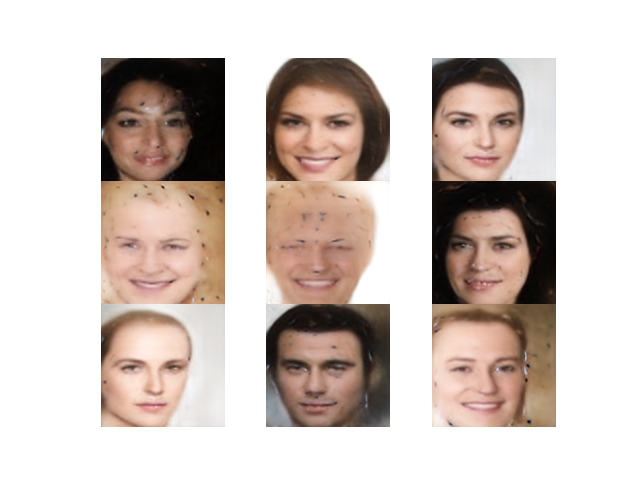
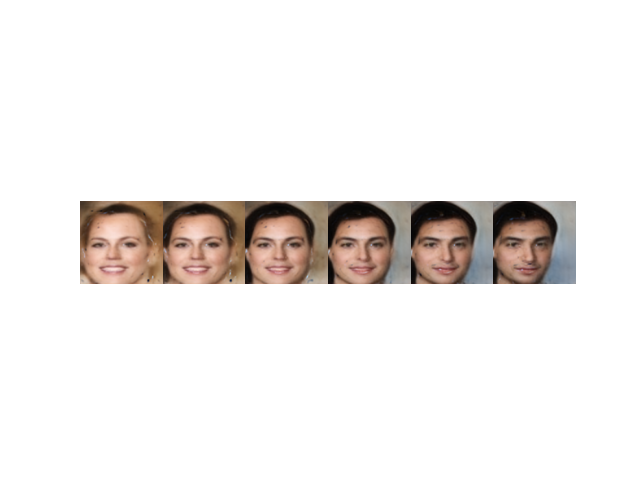
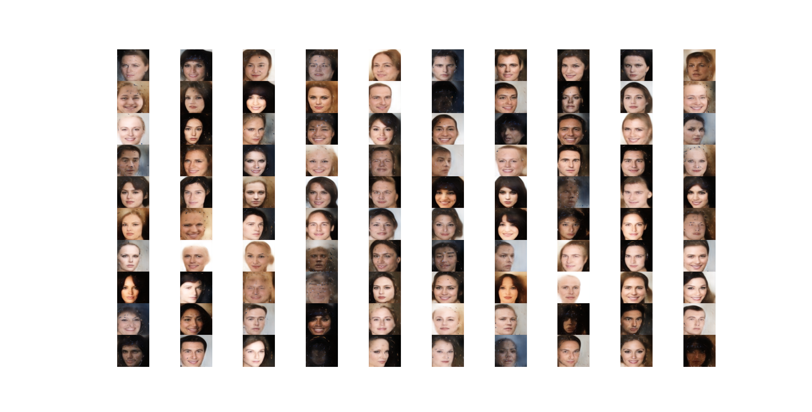

# BEGAN-keras
A BEGAN implementation using idiomatic keras. I've not seen a good implementation anywhere using keras, soooo hopefully this is the one.

[Original Paper](https://arxiv.org/pdf/1703.10717.pdf)

This is a working progress. The models compile and as far as I know the methodology is correct, but the results make no sense. I'm currently training it for more time, let's see how it goes. 
Helped by the TensorFlow implementation of [hmi88](https://github.com/hmi88/BEGAN-tensorflow).

## Training

Using the CelebA dataset jointly with the UTKFace (for some reason, but doesn't really help anything). Imo the DataLoader class is pretty self explanatory, if you don't get it ask me, but, why are you jumping into GANs?

## Results
**OMG, IT WORKED!!** It costed a lot, but here are the results:

Some random sampled faces:

A face transition between two random multidimiensional points:

Some more because why not:

